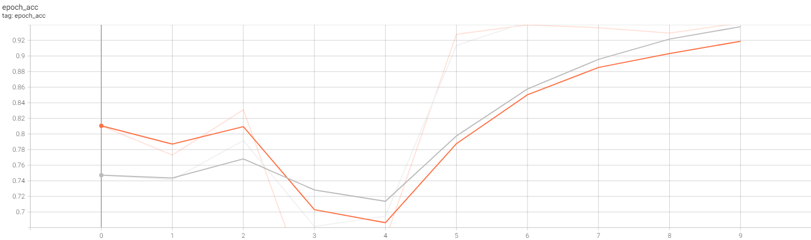
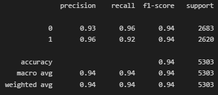
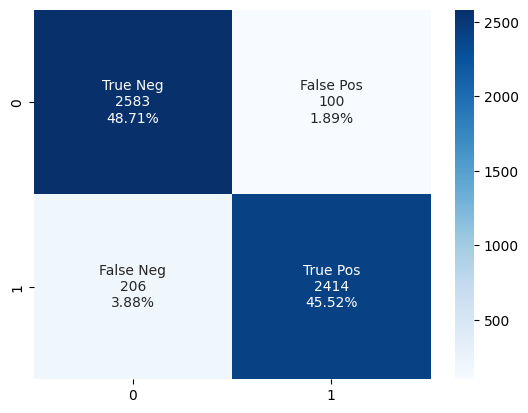

# A Deep Learning Approach for Text Classification Using LSTM

The project is created to test the effectiveness of utilizing a deep learning model to classify the intention of in the writing of an article. The model take news article from various news outlet and output the type of the article, whether it is a political news or a world news.
 
The project is made using the LSTM model which was trained with a dataset of 21471 rows of data and consisting of 4 columns, of which only 2 were used. The model had achieved an accuracy rate of 94% during testing. The detailed results of the prediction made by the model is visualized in the [Visualization](#visualization) section.
  
## Steps Taken

### Step 1 - Data loading  

> The data is load into the model from its csv dataset using pandas.read_csv().
  
### Step 2 - Data inspection  

> During data inspection, the detail of the dataset is examine and understood. The dataset is also checked for any NaN values or duplicates. The dataset does not have any NaN data but suffer from a few duplicates which needed to be remove.
  
### Step 3 - Data cleaning  

> Duplicates is removed from the dataset using pandas.drop_duplicates(), and the dataset is check again to make sure that no duplicate remains. As the model is expected to take in multiple paragraph of words as its input, the input data is filter out of any information deem unnecessary using regex. The data is then normalize to lowercase letters.
  
### Step 4 - Features selection  

> The features and targets that will be use in the model training is chosen and saved into separate variables.
 
### Step 5 - Data pre-preprocessing  

> The features is then put though tokenization and padding in order to prepare it to be feed into the model. The target is also process with one hot encoding. Finally, the features and targets is then split into train and validation data which is now ready to be taken in by the model.
  
### Step 6 - Model development  

> A model based on the LSTM is created with 2 layers and 64 nodes each. Data is then input into the model through an Embedding layer. The model is then trained for 10 epochs and the training process of the model is monitored through TensoBoard.
  
### Step 7 - Model analysis  

> The model is then evaluate wih a classification report and confusion matrix to get the complete image of how the model is doing. The results of the model can be seen in the [Visualization](#visualization) section below.

### Step 8 - Model saving

> The model, encoder and tokenizer is save into their own files to be loaded for deployment.
  
## Visualization

  

  
The accuracy graph above shows the improvement of the model's accuracy between each epoch. Albeit some struggle in the earlier epoch, the model managed to improve steadily and finished the training with around 94% accuracy in training and 92% accuracy in validation. The accuracy still show some signs of increasing and might benefit from increasing the number of epoch for training.  
  

 

  

  
The model managed to score 94% for both the accuracy and F1-score when it is used to predict some test data.  
  

 

  

  
The confusion matrix above shows that the model made a combined error of less than 6% for the test data, with 1.89% of False Positive and 3.88% of False Negative.

## Acknowledgement

Thanks to [Clément Bisaillon](https://www.kaggle.com/datasets/clmentbisaillon/fake-and-real-news-dataset) from Kaggle for sharing the awesome dataset used in this project!
